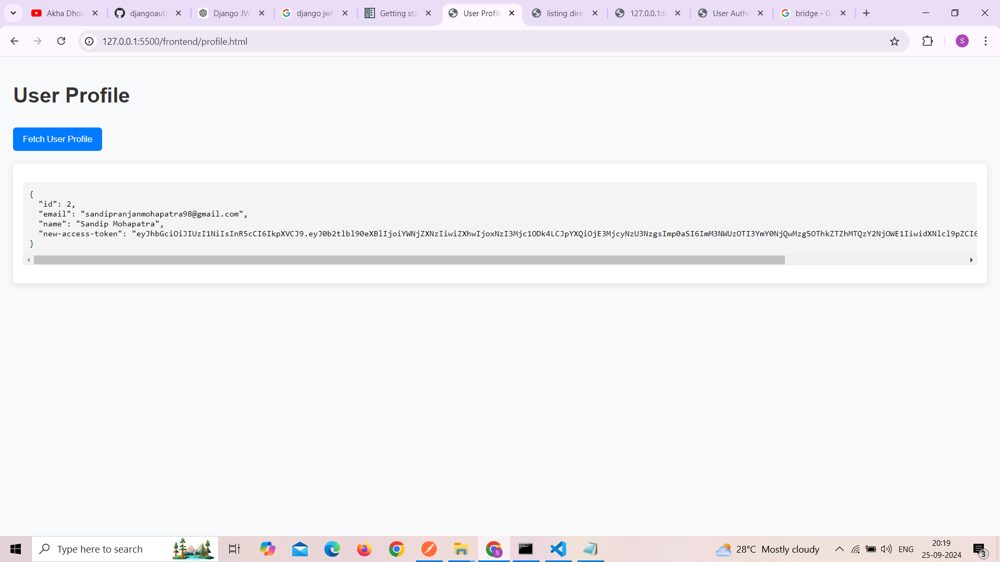

Django REST Framework Complete Authentication API with Simple JWT 
and Use Django Middleware as a bridge between api reequst and response for checking access token are expire or not if expire then use the refresh token generate new access token .

To Run this Project follow below:
----------------------------------
1. virtualenv envname
2. activate viratualenv
    For Window
    ------------
    envname\Scripts\activate
    For Linux
    -------------
    envname/bin/activate

pip install -r requirements.txt
python manage.py makemigrations
python manage.py migrate
python manage.py runserver

API Testing Propose HTML Template
-------------------------------------
Registration and Login 

User Profile

